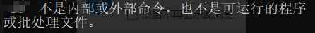

## 前言
you-get是基于Python的一个开源项目，可以通过视频URL下载视频。  
??? note "You-GET 的优缺点一览表"
    | 项目 | 优点 | 缺点 |
    | ---- | ---- | --- |
    | 1 | 可下载绝大部分的视频，目前基本没有找到不能下载的平台 | 涉及控制台、环境变量，对于小白设置复杂 |
    | 2 | 可控性强，可控制画质等内容 | 依赖多，文件大 |
## 下载
### 前置依赖:pip与python
如果您已经有了，可以跳过  
1.前往[Python官网](https://www.python.org/),选择Download->Windows->点击右边的最新版本下载。  

!!! warning "注意:"
    由于更新的时间的原因，版本号与图片不一致无伤大雅。

2.双击安装包,选择第一项"Modify"

3.直接默认即可，确保pip处于勾选状态！

4.不用动，点击install

5.下载完成后，关闭界面
### 控制台
1.按下++win+r++键，输入"cmd",点击确定
2.输入"pip install you-get"

如果出现"Successfully installed you-get-0.4.1650"代表成功
## 使用
### 测试可用性
输入"you-get"测试命令。  
#### 以下情况正常：给出语法
如果正常:您可以进行下一步了

#### 以下情况异常:不是内部或外部命令，也不是可运行的程序或批处理文件。
  
如果没给出语法的用法，请查看刚刚的安装记录是否出现黄色字体的"warning"，如果出现，请自行翻译，查看其要表达的意思
是否是"you-get目录不在环境变量中",如果是，请按下++win+s++键，搜索“环境变量”,点击环境变量，随后点击环境变量->Path->新建，输入"warning中
黄字给出的路径"，然后一路确定即可。


### 基础语法
``` powershell
you-get "下载地址的URL" 
```
十分简单，就不再附带图片解释了
### 高级语法
我实在不想翻译了，所以给你拷下来机翻了一下，凑合着看吧
=== "原版英文:"
    !!! successful "你很有钻研精神啊，小伙子"
        其实这里大部分人看不懂，也许你是万里挑一的人?
    usage: you-get [OPTION]... URL...  
  
    A tiny downloader that scrapes the web  
  
    optional arguments:  
    -V, --version         Print version and exit  
    -h, --help            Print this help message and exit  

    Dry-run options:  
    (no actual downloading)  
  
    -i, --info            Print extracted information  
    -u, --url             Print extracted information with URLs  
    --json                Print extracted URLs in JSON format  
  
    Download options:  
    -n, --no-merge        Do not merge video parts  
    --no-caption          Do not download captions (subtitles, lyrics, danmaku, ...)  
    --postfix             Postfix downloaded files with unique identifiers  
    -f, --force           Force overwriting existing files  
    --skip-existing-file-size-check  
                            Skip existing file without checking file size  
    -F STREAM_ID, --format STREAM_ID  
                            Set video format to STREAM_ID  
    -O FILE, --output-filename FILE  
                            Set output filename  
    -o DIR, --output-dir DIR  
                            Set output directory  
    -p PLAYER, --player PLAYER  
                            Stream extracted URL to a PLAYER  
    -c COOKIES_FILE, --cookies COOKIES_FILE  
                            Load cookies.txt or cookies.sqlite  
    -t SECONDS, --timeout SECONDS  
                            Set socket timeout  
    -d, --debug           Show traceback and other debug info  
    -I FILE, --input-file FILE  
                            Read non-playlist URLs from FILE  
    -P PASSWORD, --password PASSWORD  
                            Set video visit password to PASSWORD  
    -l, --playlist        Prefer to download a playlist  
    -a, --auto-rename     Auto rename same name different files  
    -k, --insecure        ignore ssl errors  
    -m, --m3u8            download video using an m3u8 url  
  
    Playlist optional options:  
    --first FIRST         the first number  
    --last LAST           the last number  
    --size PAGE_SIZE, --page-size PAGE_SIZE  
                            the page size number  
  
    Proxy options:  
    -x HOST:PORT, --http-proxy HOST:PORT    
                            Use an HTTP proxy for downloading    
    -y HOST:PORT, --extractor-proxy HOST:PORT   
                            Use an HTTP proxy for extracting only   
    --no-proxy            Never use a proxy   
    -s HOST:PORT or USERNAME:PASSWORD@HOST:PORT, --socks-proxy HOST:PORT or USERNAME:PASSWORD@HOST:PORT    
                            Use an SOCKS5 proxy for downloading    
=== "机翻中文:" 
    !!! error "凑合着看吧"
        实在太乱了
    用法：您得到[OPTION]。。。URL。。。  
    一个小型下载程序，可以抓取网络  
    可选参数：  
    -V、 --version打印版本并退出  
    -h、 --help打印此帮助消息并退出  
    干式运行选项：  
    （没有实际下载）  
    -i、 --info打印提取的信息  
    -u、 --url使用url打印提取的信息  
    --json以json格式打印提取的URL  
    下载选项：  
    -n、 --不合并不合并视频部分  
    --无字幕不下载字幕（字幕，歌词，danmaku，…）  
    --postfix postfix下载的具有唯一标识符的文件  
    -f、 --force强制覆盖现有文件  
    --跳过现有文件大小检查  
    跳过现有文件而不检查文件大小  
    -F STREAM_ID，--格式STREAM_IID  
    将视频格式设置为STREAM_ID  
    -O FILE，--输出文件名FILE  
    设置输出文件名  
    -o DIR，--输出DIR目录  
    设置输出目录  
    -p播放器，--播放器  
    将提取的URL流式传输到播放器  
    -c COOKIES_FILE，--COOKIES COOKIES-FILE  
    加载cookies.txt或cookies.sqlite  
    -t秒，--超时秒  
    设置套接字超时  
    -d、 --debug显示回溯和其他调试信息  
    -I FILE，--输入文件FILE  
    从FILE读取非播放列表URL  
    -P密码，--密码  
    将视频访问密码设置为password  
    -l、 --播放列表首选下载播放列表  
    -a、 --自动重命名自动重命名相同名称的不同文件  
    -k、 --不安全的忽略ssl错误  
    -m、 --m3u8使用m3u8 url下载视频  
    播放列表可选选项：  
    --first first第一个数字  
    --last last最后一个数字  
    --大小PAGE_size，--页面大小PAGE_IZE  
    页面大小编号  
    代理选项：  
    -x主机：端口，-http代理主机：端口  
    使用HTTP代理进行下载  
    -y主机：端口，--提取器代理主机：端口  
    仅使用HTTP代理进行提取  
    --无代理从不使用代理  
    -s主机：端口或用户名：PASSWORD@HOST：端口，--socks代理主机：端口或用户名：PASSWORD@HOST：端口  
    使用SOCKS5代理进行下载  
## 结语
you-get介绍到此为止，或许你是为了白嫖，或许你是为了离线观看，但是都逃不了最后的暴击  
那——就——是  
!!! warning "免责声明"
    无论如何，我不承担任何责任